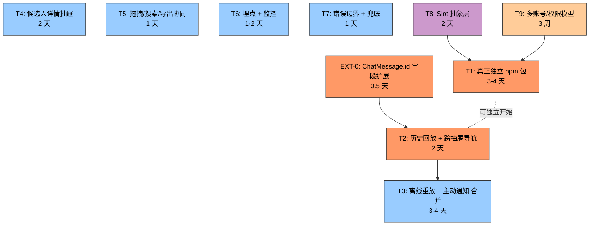

# Context Bar 下一阶段 Roadmap

> 创建于 2026-06-04 · 状态：待开工 · 优先级：P0 → P1 → P2 → P3

## 背景

已完成：Context Bar 0+1+2+3+4+5 + 5 个 Bonus（SessionStats、RecentActivity、PendingApproval、QuickActions、SearchBar、拖拽）+ packages/context-bar facade + Redis pub/sub + 24 commits 推送。

详见 `apps/web/components/common/context-bar/README.md`。

本文件定义下一阶段任务清单、依赖关系、验收标准、推荐执行顺序。

---

## 1. 依赖图



**关键观察**：
- T2 阻塞 → 必须先做 EXT-0
- T3 与 T4/T5/T6/T7 独立，可并行
- T1 与其它任务独立，**T8 推迟到 T1 之后**才有意义

---

## 2. 速查表

| ID | 任务 | 估时 | 优先级 | 前置 | 核心风险 |
|---|---|---|---|---|---|
| EXT-0 | ChatMessage.id 字段 | 0.5d | P0 | — | parser 引用点 grep |
| T1 | 真正独立 npm 包 | 3-4d | P0 | — | unbuild 选型 + Tailwind 依赖 |
| T2 | 历史回放 + 跨抽屉导航 | 2d | P0 | EXT-0 | scrollIntoView 兼容性 |
| T3 | 离线重放 + 主动通知 | 3-4d | P1 | — | Redis Stream MAXLEN |
| T4 | 候选人详情抽屉 | 2d | P1 | — | 后端 schema 确认 |
| T5 | 拖拽/搜索/导出协同 | 1d | P1 | — | URL hash 长度 |
| T6 | 埋点 + 监控 | 1-2d | P1 | — | PII 隔离 |
| T7 | 错误边界 + 兜底 | 1d | P1 | — | ErrorBoundary 误捕获 |
| T8 | Slot 抽象层 | 2d | P2 | T1 | 推迟到第 2 团队 |
| T9 | 多账号/权限模型 | 3 周 | P3 | T1 | RBAC 粒度 |

**总工期**：P0 = 5.5-6.5d，P0+P1 = 13.5-16.5d（17-21 天目标范围内）

---

## 3. P0 任务详情

### EXT-0 · ChatMessage.id 字段扩展

**前置依赖**：无

**验收标准**：
- [ ] `apps/web/types/chat.ts` 加 `id: string` + `createdAt: string`
- [ ] `use-chat-messages` 持久化时生成 `id = crypto.randomUUID()` + `createdAt = Date.now().toISOString()`
- [ ] `use-chat-stream` 在 `setMessages` 添加 assistantMsg 时生成 id
- [ ] `parseDataCardsFromMessage` 用 `messageId: msg_${idx}` 改为 `messageId: msg.id`
- [ ] tsc 0 错误
- [ ] 14/14 单元测试 + 16/16 e2e 仍通过

**风险**：
- data-card-parser 的 messageId 字段类型如果是 `string` 而非 `string | undefined` 可能 break
- 改前先 grep `messageId` 全部使用点

**与现有规范对齐**：
- pre-commit hooks：未涉及
- test coverage 50%：维持
- 文档：更新 chat types 注释

**Definition of Done**：
- 用户验证：在 /agent 发消息，刷新后消息稳定有 id
- 演示路径：devtools → Application → LocalStorage → "agent-chat-history" → 任一消息都有 id 字段

---

### T1 · Context Bar 真正独立 npm 包

**前置依赖**：无

**验收标准**：
- [ ] 选型确定：**unbuild**（比 tsup 更轻，Next.js 14 + React 18 SSR 兼容好）
- [ ] `packages/context-bar/src/` 实际承载代码（不再是 facade）
- [ ] `packages/context-bar/dist/` 输出：ESM + CJS + 完整 .d.ts
- [ ] `package.json` 加 `"exports"` 字段：`{ ".": { "types": "...", "import": "...", "require": "..." } }`
- [ ] apps/web 改用 `@ai-recruitment/context-bar` 引用 dist
- [ ] apps/web 中 `apps/web/components/common/context-bar/` 目录**完全删除**
- [ ] tsc 0 错误
- [ ] 16/16 e2e + 14/14 单元测试全过
- [ ] `pnpm --filter @ai-recruitment/context-bar build` 成功

**风险**：
- **路径深度变化**：当前 `../lib/utils` 在抽取后会变 `../../lib/utils`（深度 +1）；要批量 sed 重写
- **Next.js 14 RSC 边界**：context-bar 组件需保持 "use client"，build 时不能误转 RSC
- **Tailwind 样式丢失**：unbuild 不处理 CSS；组件已用 Tailwind class，依赖 apps/web 全局样式——需要在 apps/web 引入 `@ai-recruitment/context-bar/dist/style.css` 或者文档说明"依赖宿主项目的 Tailwind"

**与现有规范对齐**：
- pre-commit enum check：未涉及
- test coverage 50%：抽取后需在 packages/context-bar 单独跑 vitest
- README：写"如何在 monorepo 外消费"的章节

**Definition of Done**：
- 用户验证：删除 `apps/web/components/common/context-bar/` 目录后 `pnpm dev` 仍能正常运行
- 演示路径：清空 `apps/web` 内 context-bar 残留文件 → 完整重启 dev server → 16/16 e2e 全过
- 可独立测试：在 packages/context-bar 跑 `pnpm build` + `pnpm test` 都不依赖 apps/web

---

### T2 · 历史回放 + 跨抽屉导航

**前置依赖**：**EXT-0（ChatMessage.id）**

**验收标准**：
- [ ] RecentActivitySection 列表项 `<button>` 可点击
- [ ] 点击 message-kind 项 → 跳 `/agent` 并 `scrollIntoView` 到对应消息（带 `data-message-id="${msg.id}"` 锚点）
- [ ] 点击 card-kind 项 → 跳 `/agent` 并高亮（黄色背景 1.5s）引用该卡片的消息
- [ ] CurrentContextSection 候选人/职位 chip 可点击 → 跳 `/candidates/{id}` 或 `/jobs/{id}` 详情页
- [ ] 路由跳转通过 Next.js `useRouter` 实现（不要 hard navigate）
- [ ] /agent 页面 `scrollIntoView({ behavior: "smooth", block: "center" })` 在 mount 时执行
- [ ] 1 个新 E2E：用例：发消息 → 跳到 /candidates → 点 ContextBar 候选人 chip → 验证跳回 /agent 并定位
- [ ] tsc 0 错误

**风险**：
- **短消息列表**（1-2 条消息）`scrollIntoView` 可能没效果 → 降级方案：直接展开该消息的 JsonPreview
- **跨页面状态丢失**：从 /candidates 跳回 /agent 时，messages 是否还在？依赖 useChatMessages 的内存 state（不是 store 持久化），所以在 /agent 页面 mount 时会从 localStorage 恢复——OK
- **mobile 长消息列表**：scrollIntoView 在移动端可能被键盘弹出遮挡

**与现有规范对齐**：
- pre-commit：未涉及
- test：加 1 个 e2e 用例
- README：更新跨抽屉导航交互图

**Definition of Done**：
- 用户验证：从任意 dashboard 页面打开 ContextBar → 点击候选人 chip → 1 跳到候选人详情 / 2 看到候选人 ID 出现在 URL / 3 返回 /agent 后看到原消息被定位高亮
- 演示路径：录制 30s 屏幕录像，跨 3 个页面跳转

---

## 4. P1 任务详情

### T3 · 离线事件重放 + 主动通知（合并原 #3 和 #9）

**前置依赖**：无

**验收标准**：
- [ ] 后端：`agent_events.py` 接入 Redis Streams（`XADD agent_events:stream:{user_id} MAXLEN ~ 1000 *`）
- [ ] 每个 event 自动加 `id: stream_msg_id`（Redis Stream 生成的）
- [ ] SSE 端点支持 `Last-Event-ID` query param：自动 `XRANGE` 之后的新事件 + 实时 stream
- [ ] 前端：EventSource 实例化时记录 `lastEventId`，断线重连时把 `lastEventId` 传回后端
- [ ] 后端新增 `emit_ai_notification(user_id, title, body, action_url)` 工具函数
- [ ] 触发场景：候选人状态变更时（`/applications` 更新）自动调 emit_ai_notification
- [ ] 前端：新建 `NotificationsSection`（在抽屉顶部，铃铛 + 徽章）
- [ ] 浏览器 Notification API 集成（含权限请求 UX：在 ContextBar 首次打开时弹一次）
- [ ] 离线积压事件重连后批量 replay（最多 50 条/连接）
- [ ] 1 个新 E2E：模拟后端 emit 5 条 → 验证前端 5 条都到
- [ ] 1 个新 E2E：模拟断线 10s → emit 2 条 → 验证重连后收到
- [ ] tsc 0 错误

**风险**：
- **Redis Stream 容量**：MAXLEN 设置不当可能丢事件；建议 `MAXLEN ~ 1000`，每用户 1000 条足够 24h
- **重连去重**：EventSource 原生支持 lastEventId；后端 XRANGE 已读位置；无需手动去重
- **Notification API 权限拒绝**：用户可能拒绝；降级为抽屉内 badge + sonner toast
- **触发风暴**：批量更新 100 个候选人状态可能 emit 100 条通知；加节流（1 秒钟最多 1 条同类通知）

**与现有规范对齐**：
- pre-commit：未涉及
- alembic：未涉及（Redis 不需要 schema migration）
- test coverage：后端 event replay 加 pytest；前端 SSE 行为加 e2e
- 文档：更新 README 离线重放架构图

**Definition of Done**：
- 用户验证：故意断网 30s → 后端发 5 条 → 重连后能收到全部 5 条
- 演示路径：演示 1) 实时通知 2) 离线后追平 3) 浏览器原生通知弹出
- 性能：1000 events 持久化耗时 < 100ms（Redis 本地）

---

### T4 · 候选人详情抽屉

**前置依赖**：无

**验收标准**：
- [ ] 新建 `CandidateDetailSection` 组件
- [ ] 候选人 chip 旁加 ➕ 按钮 → 在抽屉内展开详情卡片
- [ ] 详情卡片内容：头像 / 姓名 / 当前职位 / 公司 / 邮箱 / 技能（前 5 个）
- [ ] 数据源：`GET /api/v1/candidates/{id}`（后端已存在）
- [ ] "在助手中继续讨论"按钮：跳 /agent 并预填消息（模板：`"帮我详细分析候选人 {name} 的 {current_title} 经验"`，可被用户编辑）
- [ ] 失败兜底：API 错误显示 `加载失败 [重试]` 按钮
- [ ] Loading 状态：skeleton + spinner
- [ ] 1 个新 E2E：mock 候选人 API → 点击 ➕ → 验证详情渲染
- [ ] tsc 0 错误

**风险**：
- **后端候选人 schema 未确认**：需要先 grep `/candidates/{id}` 端点存在和返回字段
- **认证**：候选人信息可能有权限控制；调用失败要明确"无权限"vs"不存在"
- **移动端体验**：详情卡片在移动端底部 sheet 内可能内容溢出

**与现有规范对齐**：
- pre-commit：未涉及
- test：API mock 完整
- 文档：README 加候选人详情抽屉的截屏

**Definition of Done**：
- 用户验证：点击 chip → 看到候选人完整信息 → 点"在助手中继续讨论" → 跳到 /agent 并消息已预填
- 演示路径：录制 30s 录像

---

### T5 · 拖拽/搜索/导出协同

**前置依赖**：无

**验收标准**：
- [ ] 拖拽后 URL hash 同步：`#cards=id1,id2,id3`（分享链接恢复顺序）
- [ ] 拖拽到抽屉外（drop on body）= 取消并回滚到原顺序
- [ ] 搜索结果支持 ⌘↑/↓ 键盘上下选择 + Enter 展开
- [ ] 导出 JSON 包含：sort order、当前 filter snapshot、export timestamp
- [ ] 1 个新 E2E：拖动卡片 → 验证 hash 更新 → 复制 URL → 新 tab 打开 → 验证顺序一致
- [ ] tsc 0 错误

**风险**：
- **URL hash 长度**：100 张卡片可能超 URL 长度限制（8192 字符）→ 降级为只 hash 顺序字段而非完整 id
- **跨设备 hash 同步**：URL hash 不跨 BroadcastChannel 同步 → 接受限制（hash 是 per-session 状态）

**与现有规范对齐**：
- pre-commit：未涉及
- test：e2e 拖拽 + hash 同步
- 文档：README 更新导出格式说明

**Definition of Done**：
- 用户验证：拖动 3 张卡片 → URL hash 变化 → 复制 URL 新 tab 打开 → 看到相同顺序
- 演示路径：截屏拖拽前后 + URL 前后

---

### T6 · 埋点 + 监控

**前置依赖**：无

**验收标准**：
- [ ] 前端埋点（用 `console.info` + 自定义 queue，不引第三方）：抽屉 open/close、卡片点击、搜索 keystroke、拖拽完成
- [ ] 埋点通过 `POST /api/v1/agent/telemetry` 发送（后端简单 log 到 stdout）
- [ ] 后端埋点：emit 次数、Redis publish latency、SSE active connection count
- [ ] 后端新增 `GET /metrics` 端点返回 Prometheus 格式（最小：3 个 counter + 1 个 gauge）
- [ ] 1 个新 E2E：触发 5 个事件 → 验证后端 /metrics 计数 +5
- [ ] 文档：列出所有埋点事件和指标名

**风险**：
- **性能开销**：高频埋点（如 search keystroke）需要 throttle（500ms 一次）
- **PII 泄漏**：埋点不能包含候选人姓名、邮箱；只埋元数据
- **现有 /health 端点**：是否复用还是新加 — 决定用新加 `/metrics`（不同 audience）

**与现有规范对齐**：
- pre-commit：未涉及
- test：埋点 mock
- 文档：README 加监控章节

**Definition of Done**：
- 用户验证：访问 `/metrics` → 看到 `agent_events_emitted_total{event="chat_response"} 42`
- 演示路径：演示前端埋点 → 后端日志 → Prometheus 抓取

---

### T7 · 错误边界 + 兜底

**前置依赖**：无

**验收标准**：
- [ ] ContextDrawer 内部加 ErrorBoundary（避免抽屉白屏）
- [ ] SSE 解析错 → 跳过该 event + 计数（console.warn 而非 throw）
- [ ] BroadcastChannel 不支持 → console.debug 提示，已实现
- [ ] Redis 断线 → 自动 reconnect 指数退避（1s, 2s, 4s, 8s, max 30s）
- [ ] 抽屉 store 完全 fail → ContextChip 仍可见（用 useState 而非 useAgentStore）
- [ ] 1 个新 E2E：mock 一个会 throw 的 section → 验证 ErrorBoundary fallback 显示
- [ ] 1 个新 E2E：mock BroadcastChannel 不可用 → 验证 ContextBar 仍工作
- [ ] tsc 0 错误

**风险**：
- **ErrorBoundary 误捕获**：把设计内的 throw 也兜住 → 加 error name 白名单
- **指数退避总时长**：从 1s 累加到 30s 然后无限循环 → 加 max 5 次重试后告警

**与现有规范对齐**：
- pre-commit：未涉及
- test：故障注入 e2e
- 文档：README 加错误处理矩阵

**Definition of Done**：
- 用户验证：手动 throw 一个 error → 抽屉显示 fallback 而非白屏
- 演示路径：截图对比正常 vs 错误状态

---

## 5. P2 任务详情

### T8 · Slot 抽象层

**前置依赖**：T1 独立包完成后才有意义

**理由推迟**：当前 6 个 section 全部由 1 个维护者写，**真实开发时间 < 5 分钟/个**。抽象为 registry 后：
- 调试成本增加（devtools 看到的是注册表不是 JSX）
- 类型复杂度增加
- 唯一收益："插件可独立发布"

**真正该抽象的时机**：有第 2 个团队或外部贡献者要写新 section。届时再做。

**如仍要做（仅作记录）**：
- `ContextSlot` 接口：`{ id, title, render: () => ReactNode, getBadgeCount? }`
- `slotRegistry: Map<string, ContextSlot>` 暴露 `registerSlot/unregisterSlot`
- ContextBar 改为 `slotRegistry.values().map(slot => slot.render())`

---

## 6. P3 任务详情

### T9 · 多账号 / 权限模型

**前置依赖**：T1 独立包（这样 section 可被权限化）

**理由重新估算为 3 周**：
- 后端 RBAC 改造：1 周（role_to_permissions 粒度细化、ACL 中间件）
- 前端权限检查：1 周（14 个 dashboard 页面 + 抽屉 section 过滤）
- 测试 + 灰度：1 周

**核心改动**（仅概述）：
- event envelope 加 `user_role` 字段
- 后端 emit 时检查发布者与接收者权限关系
- 前端 ContextBar 接收 `user_role`，过滤可见 section

**Definition of Done**：
- HR 看到所有 6 个 section
- 面试官只看到日程 / 候选人（看不到数据看板）
- 候选人自己看到 0 个 section（只读自己相关）

---

## 7. 推荐开工顺序

```
第 1 周：
  Day 1:     EXT-0 (0.5d) + 开始 T1 (3-4d)
  Day 2-4:   T1 继续
  Day 5:     T1 收尾

第 2 周：
  Day 1-2:   T2（前置 EXT-0 已完）
  Day 3-5:   T3（独立基础设施）

第 3-4 周：
  Day 6-7:   T4
  Day 8:     T5
  Day 9-10:  T6
  Day 11:    T7

第 5 周起：可选 P2/P3
```

**第一波交付推荐**：EXT-0 + T1 + T2（P0 全部），共 5.5-6.5 天

---

## 8. 关联文件

- `apps/web/components/common/context-bar/README.md` — 当前架构文档
- `.omo/plans/decision-records/2026-06-03-enum-and-uuid-pattern.md` — 项目模型规范
- `apps/web/hooks/chat/use-agent-event-stream.tsx` — 事件订阅实现（T3 要扩展）
- `apps/api/app/api/agent_events.py` — 后端事件 emit（T3 要扩展 Redis Stream）

---

## 9. 更新历史

- 2026-06-04：初版（重写自 Momus 评审反馈）
