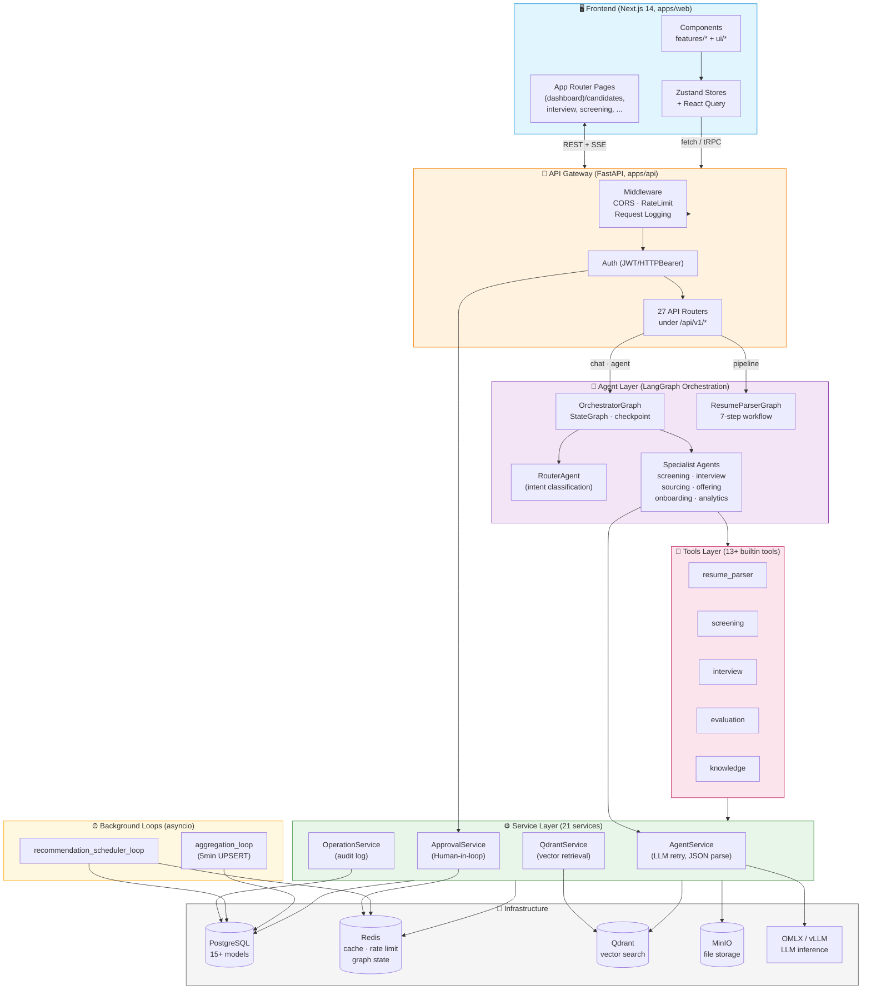
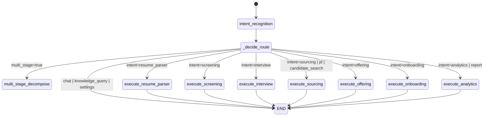
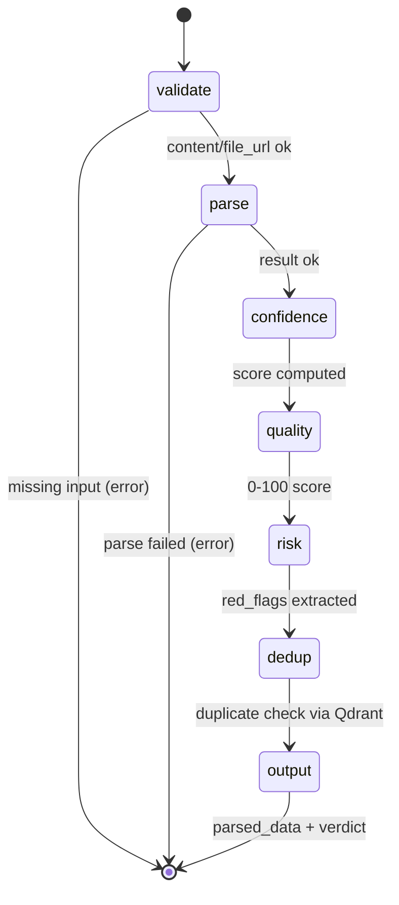
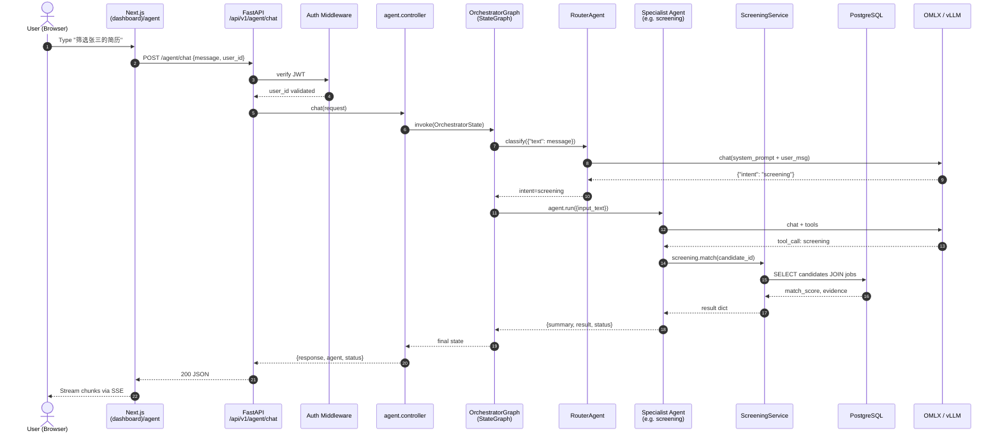
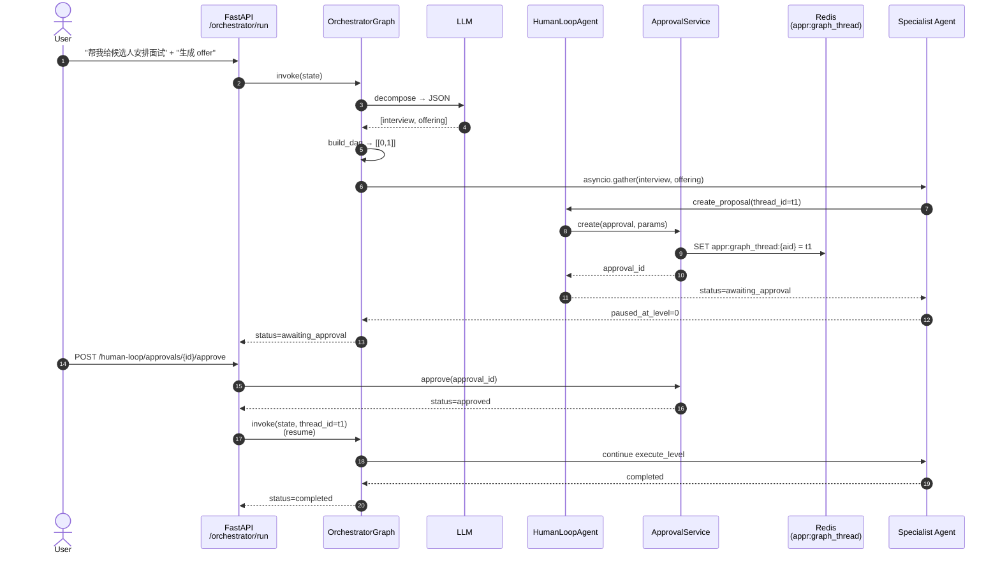
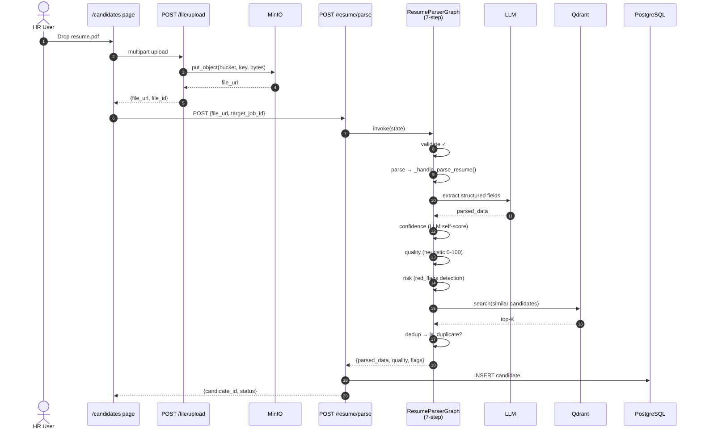
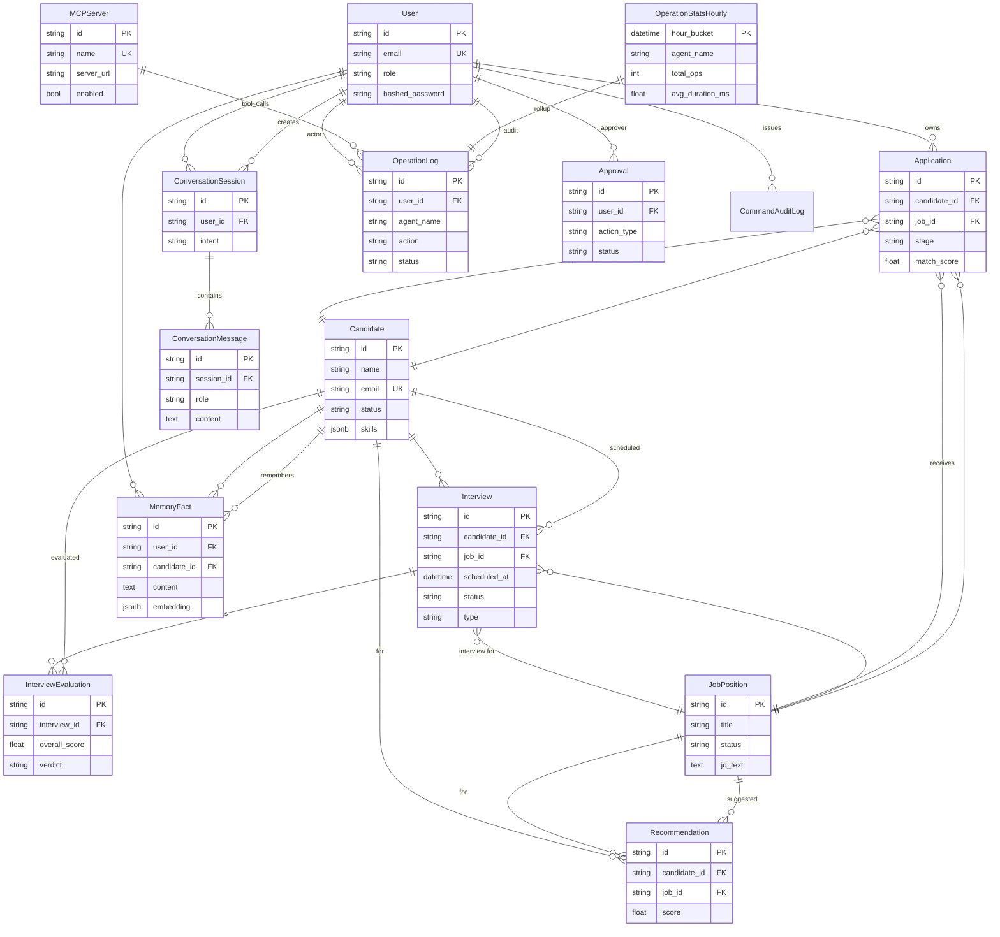
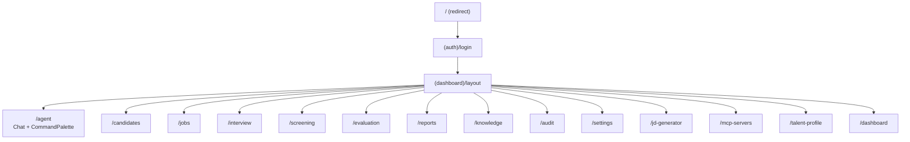
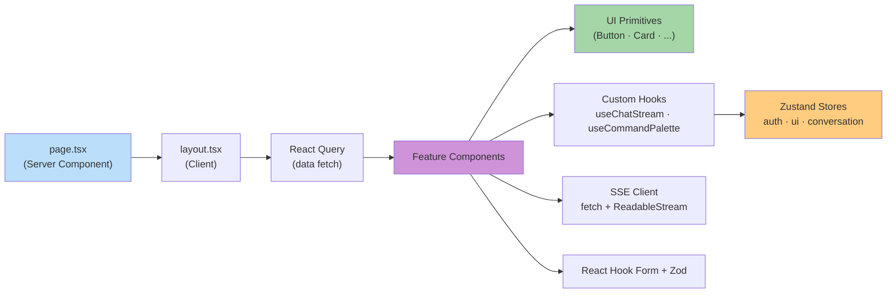
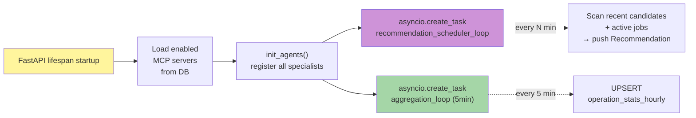

# AI Recruitment System — Architecture & Sequence Diagrams

> Generated by Sisyphus from `/Users/qixia/agent-huntersystem0523` on 2026-06-02
>
> **Stack**: FastAPI + LangGraph + Next.js 14 + PostgreSQL + Redis + Qdrant + MinIO
> **Coverage**: 90.43% · 2,014 tests passing

---

## 1. System Architecture (Bird's-Eye View)



---

## 2. Backend Layered Architecture

```mermaid
flowchart LR
    L1["① HTTP Layer<br/>FastAPI Routers<br/>(27 files)"]
    L2["② Agent Layer<br/>BaseAgent subclasses<br/>(14+ agents)"]
    L3["③ Service Layer<br/>AsyncSession + business logic<br/>(21 services)"]
    L4["④ Tool Layer<br/>OpenAI function-calling schema<br/>(13+ tools)"]
    L5["⑤ Model Layer<br/>SQLAlchemy 2.0 ORM<br/>(15+ tables)"]
    L6["⑥ Infrastructure<br/>Postgres · Redis · Qdrant<br/>MinIO · LLM"]

    L1 -->|Depends / injects| L2
    L2 -->|calls .run()| L3
    L2 -->|invokes via LLM| L4
    L3 -->|CRUD| L5
    L3 -->|side effects| L6
    L4 -->|uses| L3
    L5 --> L6

    style L1 fill:#bbdefb
    style L2 fill:#ce93d8
    style L3 fill:#a5d6a7
    style L4 fill:#f48fb1
    style L5 fill:#ffcc80
    style L6 fill:#b0bec5
```

---

## 3. Orchestrator Graph — Single-Intent Flow



---

## 4. Orchestrator Graph — Multi-Stage DAG (PR-V.1)

```mermaid
flowchart TB
    Start([START]) --> IR[intent_recognition<br/>RouterAgent.is_multi_intent]
    IR -->|multi=True| MSD[multi_stage_decompose<br/>LLM JSON · build_dag]
    IR -->|single| Single["execute_*<br/>(see §3)"]
    Single --> End1([END])

    MSD -->|levels: List[List[int]]| EL[execute_level<br/>asyncio.gather<br/>sub-tasks in level]
    EL --> SC{_should_continue_or_pause}
    SC -->|awaiting_approval<br/>paused_at_level set| Pause([END · pause<br/>Redis: appr:graph_thread])
    SC -->|error| End2([END])
    SC -->|more levels| EL
    SC -->|all done| End3([END · completed])

    Pause -.->|PR-V.2 /resume| EL

    style MSD fill:#fff59d
    style EL fill:#ce93d8
    style SC fill:#ffcc80
    style Pause fill:#ef9a9a
    style End3 fill:#a5d6a7
```

---

## 5. Resume Parser Graph (7-step Linear)



---

## 6. Sequence Diagram: POST `/api/v1/agent/chat` (Single Intent)



---

## 7. Sequence Diagram: Multi-Stage Orchestration (awaiting_approval pause)



---

## 8. Sequence Diagram: Resume Upload + Parse (POST /resume)



---

## 9. Database ER Diagram



---

## 10. API Surface (27 Routers)

| Prefix | Tag | Purpose |
|---|---|---|
| `/api/v1/auth` | Auth | Login, register, refresh |
| `/api/v1/agent` | Agent | Single-agent chat |
| `/api/v1/pipeline` | Pipeline | Sequential screening |
| `/api/v1/router` | Router | Intent classification |
| `/api/v1/parallel` | Parallel | Aggregator pattern |
| `/api/v1/orchestrator` | Orchestrator | Multi-stage DAG |
| `/api/v1/loop` | Loop | Gen-Eval loop |
| `/api/v1/human-loop` | Human Loop | Approval workflow |
| `/api/v1/mcp` | MCP | Server registry |
| `/api/v1/tools` | Tools | Tool discovery + exec |
| `/api/v1/retrieval` | Retrieval | Vector search |
| `/api/v1/knowledge` | Knowledge | RAG KB |
| `/api/v1/memory` | Memory | Cross-session facts |
| `/api/v1/candidates` | Candidates | CRUD |
| `/api/v1/jobs` | Jobs | CRUD |
| `/api/v1/applications` | Applications | CRUD |
| `/api/v1/interviews` | Interviews | Schedule + manage |
| `/api/v1/evaluations` | Evaluations | Scoring |
| `/api/v1/screen` | Screening | Match + score |
| `/api/v1/conversation` | Conversation | Multi-turn |
| `/api/v1/recommendations` | Recommendations | Proactive |
| `/api/v1/operations` | Operations | Audit log |
| `/api/v1/audit` | Audit | Command audit |
| `/api/v1/tasks` | Tasks | Async task list |
| `/api/v1/dashboard` | Dashboard | Stats + reports |
| `/api/v1/resume` | Resume | Parse endpoint |
| `/api/v1/file` | File | MinIO upload |
| `/api/v1/settings` | Settings | Per-user config |
| `/api/v1/summaries` | Summaries | Cross-session |

---

## 11. Frontend Page Map (Next.js 14 App Router)



---

## 12. Component Architecture (Frontend)



---

## 13. Background Loops (lifespan tasks)



---

## 14. Key Design Patterns

| Pattern | Where | Why |
|---|---|---|
| **StateGraph** | orchestrator_graph · resume_parser_graph | Long-running, interruptable, checkpoint |
| **Registry** | `AgentRegistry.resolve(name)` | Decouple intent → agent mapping |
| **Tool Calling** | All agents via `llm.bind_tools()` | LLM-decided function invocation |
| **Soft Delete + Audit** | `operation_log` immutable | Every state change tracked |
| **Multi-stage DAG** | `build_dag()` topological sort | Parallel + dependent sub-tasks |
| **Redis Pub/Sub** | SSE for chat, approval events | Real-time UI updates |
| **Rate Limit** | Custom middleware (decorator-based) | Avoid Starlette #1334 |
| **LLM Retry** | `agent_service.py` exponential backoff | OMLX flaky connections |
| **Pydantic v2** | All schemas + FastAPI | Type-safe DTOs |
| **Checkpoint** | LangGraph `MemorySaver` | Resume after crash/approval |

---

*All diagrams render natively in GitHub, GitLab, VS Code, and any Mermaid-compatible viewer.*
